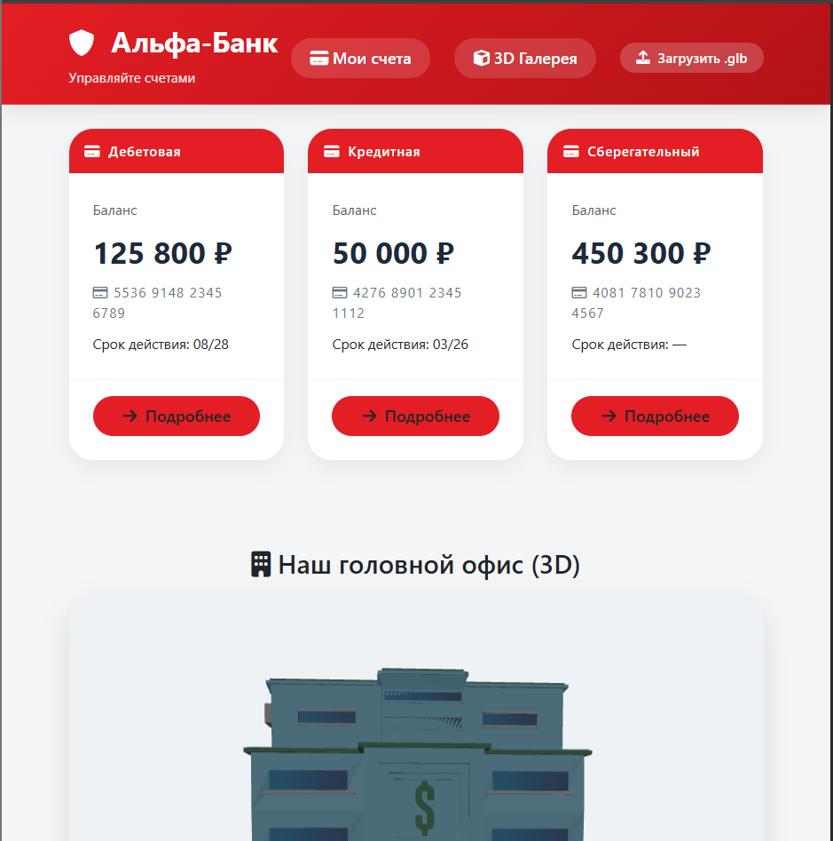

# Домашнее задание: Алгоритмические задачи + 3D‑галерея (GLB)

**Студент:** Каменских Елена Александровна
**Группа:** ИУ5‑43Б

## Содержание

1. [Часть 1. Решение задач по программированию (4 балла)](#часть-1-решение-задач-по-программированию-4-балла)
   - [Задача 2.7 – Сумма диагоналей квадратной матрицы](#задача-27--сумма-диагоналей-квадратной-матрицы)
   - [Задача 3.3 – Flatten (разворачивание вложенных массивов)](#задача-33--flatten-разворачивание-вложенных-массивов)
2. [Часть 2. 3D Галерея (GLB)](#часть-2-3d-галерея-glb)
   - [Архитектура проекта](#архитектура-проекта)
   - [Основные возможности](#основные-возможности)
   - [Запуск проекта](#запуск-проекта)
   - [Заключение](#заключение)


## Часть 1. Решение задач по программированию (4 балла)

Выполнены задачи: **2.7** (2 уровень) и **3.3** (3 уровень).


### Задача 2.7 – Сумма диагоналей квадратной матрицы

**Условие:**
Дана квадратная матрица `matrix`. Вернуть сумму элементов главной и побочной диагоналей. Элемент, находящийся на пересечении диагоналей (для нечётного размера), учитывается **один раз**.

**Решение:**

```javascript
function sumMatrixDiagonals(matrix) {
    const n = matrix.length;
    let total = 0;
    for (let i = 0; i < n; i++) {
        total += matrix[i][i];               // главная диагональ
        total += matrix[i][n - 1 - i];       // побочная диагональ
    }
    if (n % 2 === 1) {
        const mid = Math.floor(n / 2);
        total -= matrix[mid][mid];           // вычитаем центральный элемент (учтён дважды)
    }
    return total;
}
```

Пример работы:
[[1,2,3],[4,5,6],[7,8,9]] → (1+5+9)+(3+5+7)-5 = 25

### Задача 3.3 – Flatten (разворачивание вложенных массивов)

Условие:
Функция flatten(arr) принимает массив любой вложенности и возвращает плоский массив, содержащий все элементы исходного.

``` js
function flattenDeep(arr) {
    const result = [];
    function recursiveFlatten(item) {
        if (Array.isArray(item)) {
            for (const sub of item) {
                recursiveFlatten(sub);
            }
        } else {
            result.push(item);
        }
    }
    recursiveFlatten(arr);
    return result;
}
```

Пример: [1, [2, [3, [4]], 5]] → [1,2,3,4,5]

## Часть 2. 3D Галерея (GLB)

Интерактивное веб-приложение для просмотра 3D-моделей в формате GLB.
Позволяет загружать собственные модели (хранятся в IndexedDB), просматривать превью, вращать и масштабировать модели в детальном режиме.

### Архитектура проекта

``` txt
project/
├── index.html                # Главная страница (галерея)
├── detail.html               # Страница детального просмотра
├── main.js                   # Точка входа, маршрутизация
├── pages/
│   ├── main/index.js         # Главная страница (список счетов + 3D офис)
│   ├── 3d-gallery/index.js   # Галерея 3D‑моделей
│   └── 3d-detail/index.js    # Детальный просмотр модели
├── components/
│   ├── 3d-preview-card/      # Компонент превью модели
│   ├── toast/                # Уведомления
│   └── ...
├── services/
│   └── idb.js                # Работа с IndexedDB (хранение загруженных .glb)
└── models/                   # Папка с предустановленными моделями
```

### Основные возможности

1. Галерея 3D-моделей

Отображение карточек с превью (Three.js, один кадр без постоянной анимации).

Предустановленные модели (офис банка, автомобиль и др.) – загружаются из папки /models.

Загруженные пользователем модели сохраняются в IndexedDB и отображаются в галерее.

2. Загрузка своих моделей

Кнопка "Загрузить .glb" в хедере.

Файл читается через FileReader, сохраняется в IndexedDB.

После сохранения модель появляется в галерее без перезагрузки страницы.

3. Детальный просмотр

При клике на карточку открывается страница с полноэкранным Three.js‑канвасом.

Управление камерой через OrbitControls: вращение мыши, зумирование (колесико).

Кнопки быстрой смены ракурса: спереди, сзади, слева, справа.

Кнопки +/– для приближения/отдаления.

Модель автоматически центрируется по основанию (ось Y).





### Запуск проекта

1. Установите зависимости – для работы достаточно локального сервера.

2. Поместите свои .glb модели в папку models/

3. Откройте проект через Live Server (VS Code) или другой статический сервер

4. Перейдите на http://localhost:5500


### Заключение

В рамках домашнего задания решены 6 алгоритмических задач (одна 2-го уровня и пять 3-го уровня), а также разработано полноценное 3D-приложение для просмотра GLB-моделей с поддержкой загрузки пользовательских файлов и сохранением в IndexedDB. Объём кода, архитектура (компоненты, страницы, сервисы) и использованные технологии соответствуют современным стандартам веб-разработки.
