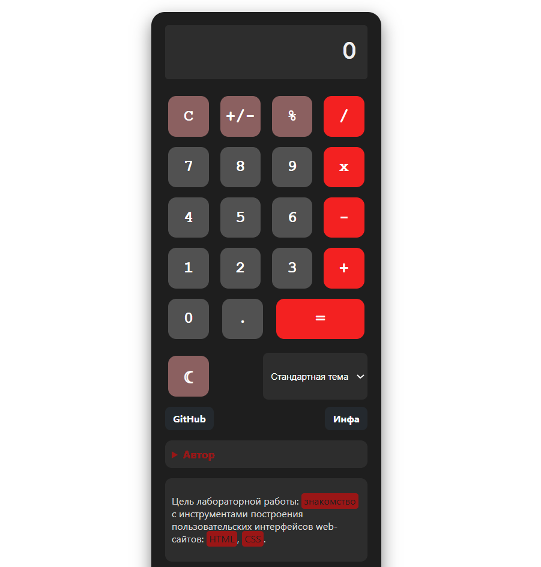
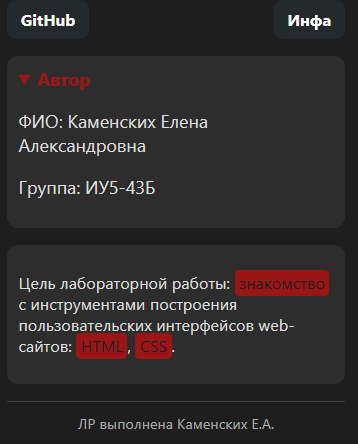

# My Project
# ЛР 1. Calculator. HTML/CSS

**Цель** данной лабораторной работы - знакомство с инструментами построения пользовательских интерфейсов web-сайтов: HTML, CSS. В ходе выполнения работы, вам предстоит ознакомиться с кодом реализации простого калькулятора,  и затем выполнить задания по варианту.

***Тема:*** Заявки от коллцентра мелкого бизнеса.

## Стиль калькулятора

Основной контейнер калькулятора центрирован на странице с помощью Flexbox. Калькулятор имеет тёмный фон (`#1e1e1e`), скруглённые углы (20px) и фиксированную ширину 300px. Внутренние отступы создают пространство между границей и кнопками. Тень добавляет глубину интерфейсу.



```css
.calculator-container {
    display: flex;
    justify-content: center;
    align-items: center;
    width: 100%;
    padding: 20px;
}

.calculator {
    background-color: #1e1e1e;
    border-radius: 20px;
    padding: 20px;
    box-shadow: 0 10px 25px rgba(0,0,0,0.5);
    width: 300px;
}
```

### Стиль кнопок калькулятора

Кнопки имеют размер 60×60px, скруглённые углы (12px) и насыщенный серый фон (#515151). Текст белый, жирный, используется моноширинный шрифт. Реализованы эффекты при наведении (изменение цвета и лёгкое увеличение) и при нажатии (затемнение и небольшое сжатие).

Стиль кнопок с цифрами от 0-9, "."

```css
.my-btn {
    margin: 5px;
    width: 60px;
    height: 60px;
    border-radius: 12px;
    border: none;
    background: #515151;
    color: white;
    font-size: 1.5rem;
    font-family: 'Courier New', monospace;
    font-weight: bold;
    cursor: pointer;
    user-select: none;
}

.my-btn:hover {
    background: #9f2e2e;
    transform: scale(1.02);
}

.my-btn:active {
    filter: brightness(85%);
    transform: scale(0.98);
}
```

Стиль кнопок "+", "-", "x", "/"

```css
.my-btn.primary {
    background: #f32121;
}

.my-btn.primary:hover {
    background: #7a0000;
}
```

Стиль остальных кнопок

```css
.my-btn.secondary {
    background: #8b6060;
}

.my-btn.secondary:hover {
    background: #644545;
}
```

### Стиль окна с результатом

Поле вывода имеет высоту 80px, тёмный фон (#2d2d2d), белый текст, выравнивание по правому краю и моноширинный шрифт увеличенного размера. Добавлена горизонтальная прокрутка для длинных чисел.

```css
.result {
    width: auto;
    height: 80px;
    background-color: #2d2d2d;
    border-radius: 5px;
    text-align: right;
    padding: 0 15px;
    margin-bottom: 20px;
    color: #f0f0f0;
    font-size: 2.5rem;
    font-family: 'Courier New', monospace;
    font-weight: bold;
    line-height: 80px;
    overflow-x: auto;
    white-space: nowrap;
}
```

## Стиль дополнительных элементов управления

Блок extra-controls содержит кнопку переключения светлой темы, выпадающий список для выбора зелёной или синей темы, а также ссылки на GitHub и информационную страницу. Элементы расположены в строку с равномерными промежутками.

```css
.extra-controls {
    display: flex;
    justify-content: space-between;
    margin-top: 15px;
    gap: 10px;
    flex-wrap: wrap;
}

.dropdown {
    padding: 8px;
    border-radius: 8px;
    background-color: #2d2d2d;
    color: white;
    border: none;
    cursor: pointer;
}

.github-link {
    display: inline-block;
    background-color: #24292e;
    color: white;
    padding: 8px 12px;
    border-radius: 8px;
    text-decoration: none;
    font-size: 0.9rem;
    font-weight: bold;
}

.github-link:hover {
    background-color: #3a3f44;
}
```

## Стиль информационных блоков



Блоки «Автор» (раскрывающийся список), «Цель лабораторной работы» и подвал оформлены в едином стиле: тёмный фон, скруглённые углы, светлый текст.

```css
.author-details {
    margin-top: 15px;
    padding: 10px;
    background-color: #2d2d2d;
    border-radius: 10px;
    color: #ddd;
}

.author-details summary {
    font-weight: bold;
    cursor: pointer;
    color: #ff000082;
}

.lab-purpose {
    margin-top: 15px;
    background-color: #2d2d2d;
    padding: 10px;
    border-radius: 10px;
    color: #ddd;
    font-size: 0.9rem;
}

.lab-purpose mark {
    background-color: #ff000084;
    color: #1e1e1e;
    padding: 2px 4px;
    border-radius: 4px;
}

.footer-note {
    margin-top: 15px;
    text-align: center;
    font-size: 0.8rem;
    color: #aaa;
    border-top: 1px solid #444;
    padding-top: 10px;
}
```


## Выпоненное дополнительное задание:
1. Реализованы три цветовые темы (светлая, зелёная, синяя) – переключение через кнопку ☾ и выпадающий список.

2. Стилизация кнопок приведена к современному дизайну: скруглённые углы, тени, эффекты при наведении и нажатии.

3. Адаптивная вёрстка – при ширине экрана менее 380px размер кнопок уменьшается, сохраняя удобство использования на мобильных устройствах.

4. Информационные блоки – добавлен раскрывающийся блок с данными об авторе, блок с целью работы и подвал.

5. Ссылки на GitHub и отдельную страницу – в панели управления размещены ссылки, открывающиеся в новой вкладке.
