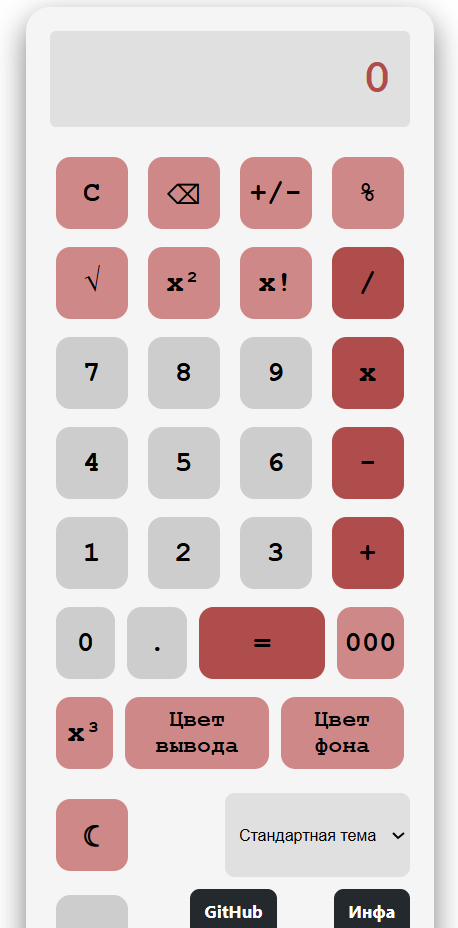
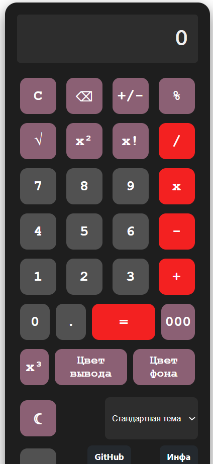

# ЛР 2. Calculator. JavaScript

**Цель** данной лабораторной работы - знакомство с инструментами построения пользовательских интерфейсов web-сайтов: HTML, CSS, JavaScript. В ходе выполнения работы, вам предстоит продолжить реализовывать простой калькулятор, и затем выполнить задания по варианту.

***Тема:*** Заявки от коллцентра мелкого бизнеса.


## Программрование кнопок калькулятора

Основная логика калькулятора реализована через обработку событий клика на кнопки. Все переменные состояния (первое число, второе число, выбранная операция) хранятся в глобальной области видимости. После загрузки страницы инициализируются обработчики событий для всех кнопок калькулятора и переключателя темы.

### Программирование кнопок с цифрами

Кнопки с цифрами (0-9, 000, ".") обрабатываются через общий обработчик событий. При нажатии на цифру она добавляется к текущему числу (a или b в зависимости от того, выбрана ли операция). Точка добавляется только один раз для каждого числа. Результат отображается в окне вывода с форматированием.

Кнопки с цифрами (0-9, ".") обрабатываются через единый обработчик. При нажатии цифра добавляется к текущему операнду с учётом максимальной длины (16 символов до точки) и предотвращением множественного добавления точки. Результат отображается в окне вывода.

```js
function appendDigit(digit) {
    if (currentOperand === 'Ошибка') clearAll();
    if (waitingForNewOperand) {
        currentOperand = digit;
        waitingForNewOperand = false;
    } else {
        if (currentOperand.replace(/\./g, '').length >= 16) return;
        if (digit === '.' && currentOperand.includes('.')) return;
        if (currentOperand === '0' && digit !== '.') {
            currentOperand = digit;
        } else {
            currentOperand += digit;
        }
    }
    updateDisplay();
}

const digitButtons = document.querySelectorAll('[id^="btn_digit_"]');
digitButtons.forEach(btn => {
    btn.addEventListener('click', () => appendDigit(btn.innerHTML));
});
```

### Программирование кнопок простых операций (+, -, *, /)

Кнопки арифметических операций сохраняют выбранную операцию в переменную operation. Перед сохранением проверяется, что первое число введено. После выбора операции ввод цифр начинает заполнять второе число.

```js
function setOperation(op) {
    if (currentOperand === 'Ошибка') clearAll();
    if (operation !== null && !waitingForNewOperand && previousOperand !== '') {
        compute();
    }
    previousOperand = currentOperand;
    operation = op;
    waitingForNewOperand = true;
    updateDisplay();
}

document.getElementById('btn_op_plus')?.addEventListener('click', () => setOperation('+'));
document.getElementById('btn_op_minus')?.addEventListener('click', () => setOperation('-'));
document.getElementById('btn_op_mult')?.addEventListener('click', () => setOperation('x'));
document.getElementById('btn_op_div')?.addEventListener('click', () => setOperation('/'));
```

### Программирование кнопки операции "="

Кнопка равно выполняет вычисление результата на основе previousOperand, operation и currentOperand. Используется оператор switch для выбора нужной арифметической операции. Результат сохраняется в currentOperand для возможности продолжения вычислений.

```js
function compute() {
    if (operation === null || previousOperand === '' || waitingForNewOperand) return;
    let prev = parseFloat(previousOperand);
    let curr = parseFloat(currentOperand);
    if (isNaN(prev) || isNaN(curr)) return;

    let result;
    switch (operation) {
        case '+': result = prev + curr; break;
        case '-': result = prev - curr; break;
        case 'x': result = prev * curr; break;
        case '/':
            if (curr === 0) {
                currentOperand = 'Ошибка (деление на 0)';
                updateDisplay();
                setTimeout(clearAll, 1500);
                return;
            }
            result = prev / curr;
            break;
        default: return;
    }
    currentOperand = result.toString();
    previousOperand = '';
    operation = null;
    waitingForNewOperand = true;
    updateDisplay();
}
```

### Программирование кнопки "С" (очистка)

Кнопка очистки сбрасывает все переменные состояния калькулятора в исходные значения и отображает ноль в окне результата.

```js
function clearAll() {
    currentOperand = '0';
    previousOperand = '';
    operation = null;
    waitingForNewOperand = false;
    updateDisplay();
}

document.getElementById('btn_op_clear')?.addEventListener('click', clearAll);
```

### Программирование кнопки "+/-" (смена знака)

Кнопка меняет знак текущего числа на противоположный (умножает на -1). Работает как для первого, так и для второго числа в зависимости от состояния калькулятора.

```js
function toggleSign() {
    let num = parseFloat(currentOperand);
    if (isNaN(num)) return;
    currentOperand = (num * -1).toString();
    updateDisplay();
}
```

### Программирование кнопки "%" (проценты)

Кнопка процентов вычисляет процент от числа. Если операция не выбрана - делит текущее число на 100. Если операция выбрана - вычисляет процент от первого числа относительно второго.

```js
function percent() {
    let num = parseFloat(currentOperand);
    if (isNaN(num)) return;
    currentOperand = (num / 100).toString();
    updateDisplay();
    waitingForNewOperand = true;
}
```

### Программирование кнопки "⌫" (удаление последнего символа)

Кнопка удаляет последний введённый символ из текущего числа. Если после удаления число становится пустым - отображается ноль.

```js
function backspace() {
    if (currentOperand === 'Ошибка') {
        clearAll();
        return;
    }
    if (currentOperand.length === 1 || (currentOperand.length === 2 && currentOperand.startsWith('-'))) {
        currentOperand = '0';
        waitingForNewOperand = false;
    } else {
        currentOperand = currentOperand.slice(0, -1);
    }
    updateDisplay();
}
```

### Программирование кнопки "√" (квадратный корень)

Кнопка вычисляет квадратный корень из текущего числа. При попытке извлечь корень из отрицательного числа отображается ошибка.

```js
function squareRoot() {
    applyUnaryOperation(num => {
        if (num < 0) throw new Error('Корень из отриц.');
        return Math.sqrt(num);
    }, 'Корень из отриц.');
}
```

### Программирование кнопки "x²" (возведение в квадрат)

Кнопка возводит текущее число в квадрат (умножает число само на себя).

```js
function square() {
    applyUnaryOperation(num => num * num);
}
```

### Программирование кнопки "x!" (факториал)

Кнопка вычисляет факториал только для неотрицательных целых чисел. При попытке вычислить факториал от отрицательного или дробного числа отображается ошибка.

```js
function factorial() {
    applyUnaryOperation(num => {
        if (num < 0 || !Number.isInteger(num)) throw new Error('Факториал только для неотр. целых');
        let res = 1;
        for (let i = 2; i <= num; i++) res *= i;
        return res;
    }, 'Факториал?');
}
```

### Программирование унарных операций с обработкой ошибок

Для унификации обработки унарных операций (квадрат, корень, факториал, куб) создана общая функция applyUnaryOperation, которая перехватывает ошибки и автоматически сбрасывает состояние через 1.5 секунды.

```js
function applyUnaryOperation(fn, errorMsg = 'Ошибка') {
    try {
        let num = parseFloat(currentOperand);
        if (isNaN(num)) throw new Error('Не число');
        let result = fn(num);
        if (isNaN(result) || !isFinite(result)) throw new Error(errorMsg);
        currentOperand = result.toString();
        waitingForNewOperand = true;
        previousOperand = '';
        operation = null;
        updateDisplay();
    } catch (e) {
        currentOperand = 'Ошибка';
        updateDisplay();
        setTimeout(() => {
            if (currentOperand === 'Ошибка') clearAll();
        }, 1500);
    }
}
```

## Программирование окна с результатом

Функция updateDisplay отвечает за форматированное отображение выражения и результата. Она отображает текущее выражение, если операция выбрана, либо просто текущий операнд. Поддерживается отображение ошибок.

```js
function updateDisplay() {
    if (operation && previousOperand !== '' && !waitingForNewOperand) {
        outputElement.innerHTML = `${previousOperand} ${operation} ${currentOperand}`;
    } else if (operation && previousOperand !== '' && waitingForNewOperand) {
        outputElement.innerHTML = `${previousOperand} ${operation}`;
    } else {
        outputElement.innerHTML = currentOperand;
    }
}
```

## Программирование кнопки переключения темы

В проекте реализованы 4 темы: стандартная (тёмная), светлая, зелёная и синяя. Переключение происходит путём добавления/удаления классов на элемент body. Кнопка сброса возвращает все темы в исходное состояние и сбрасывает случайные цвета.





```js
// Переключение светлой темы
if (themeToggle) {
    themeToggle.addEventListener('click', () => {
        document.body.classList.toggle('light-theme');
    });
}

// Выбор цветовой темы (зелёная/синяя)
if (colorSelect) {
    colorSelect.addEventListener('change', (e) => {
        const theme = e.target.value;
        document.body.classList.remove('green-theme', 'blue-theme');
        if (theme === 'green') {
            document.body.classList.add('green-theme');
        } else if (theme === 'blue') {
            document.body.classList.add('blue-theme');
        } else {
            document.body.classList.remove('green-theme', 'blue-theme');
        }
    });
}

// Полный сброс всех тем
function resetFullTheme() {
    document.body.classList.remove('light-theme', 'green-theme', 'blue-theme');
    document.body.style.backgroundColor = '';
    outputElement.style.backgroundColor = '';
    if (colorSelect) colorSelect.value = 'default';
}
```

```css
/* Светлая тема */
body.light-theme .calculator {
    background-color: #f5f5f5;
}
body.light-theme .result {
    background-color: #e0e0e0;
    color: #af4c4c;
}

/* Зелёная тема */
body.green-theme .calculator {
    background-color: #1e3a2f;
}
body.green-theme .my-btn.primary {
    background-color: #2e7d32;
}

/* Синяя тема */
body.blue-theme .calculator {
    background-color: #0d2b3e;
}
body.blue-theme .my-btn.primary {
    background-color: #1976d2;
}
```

## Выполненное дополнительное задание:

1. **Операция смены знака +/-** - реализована через обработчик toggleSign`, умножает текущее число на -1
2. **Операция вычисления процента %** - реализована через обработчик `percent`, вычисляет процент от числа
3. **Кнопка стирания ⌫** - реализована через обработчик `backspace`, удаляет последний введённый символ
4. **Смена темы (светлая/тёмная)** - реализован переключатель с выпадающим списком и кнопка сброса
5. **Квадратный корень √** - реализована через `Math.sqrt()` с проверкой на отрицательные числа
6. **Возведение в квадрат x²** - реализована через умножение числа само на себя
7. **Кнопка "000" (три нуля)** - реализована как отдельная кнопка цифрового блока, добавляет сразу три нуля к текущему числу
