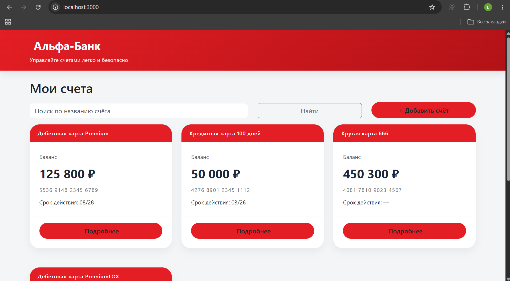
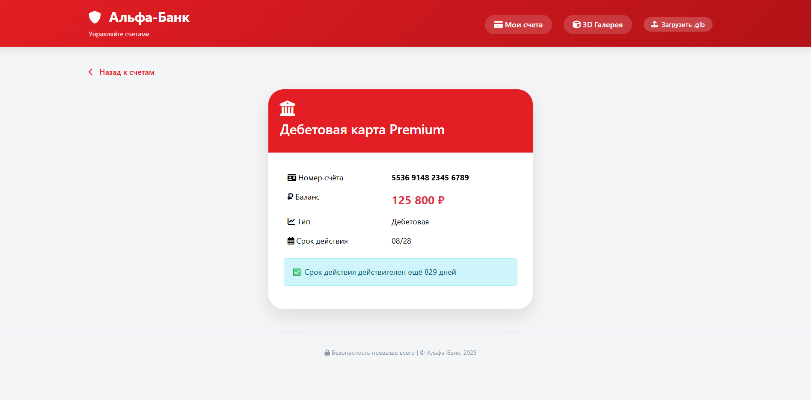
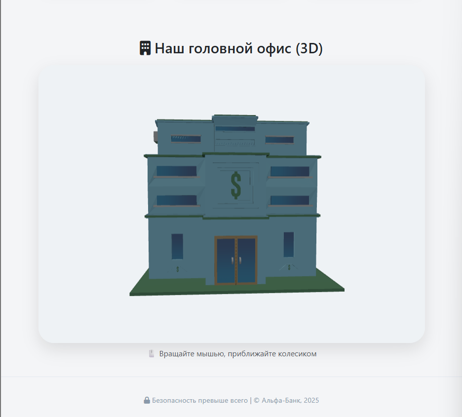
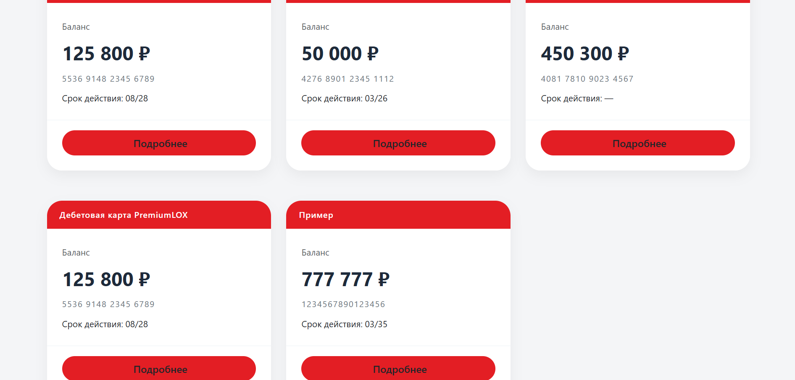
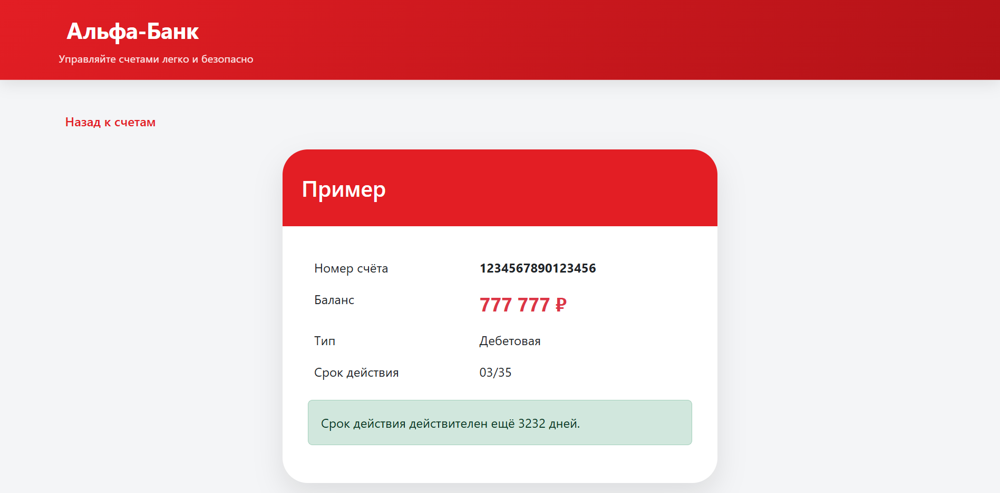
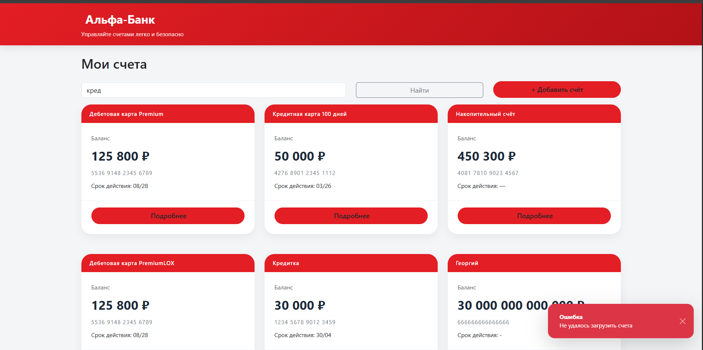
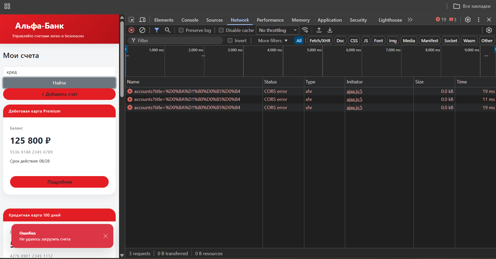
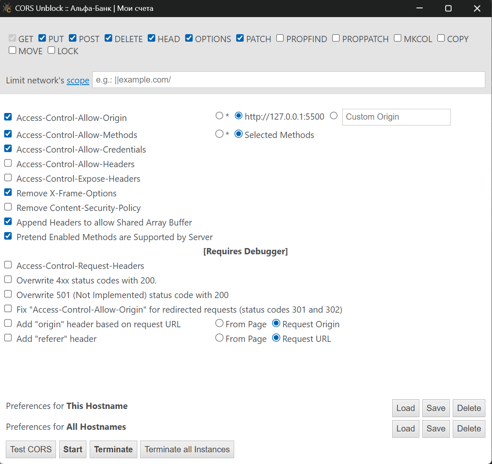
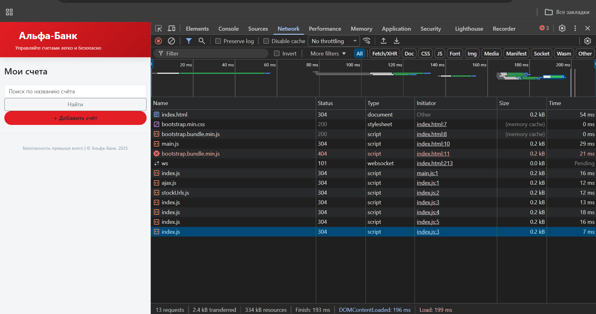
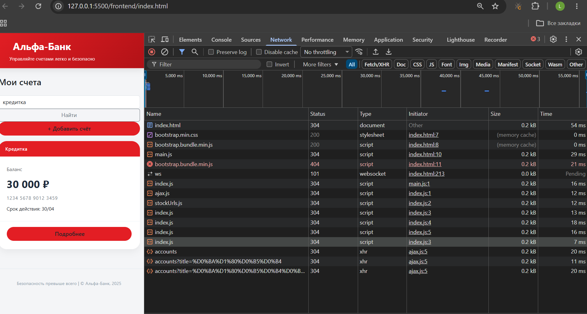

# ЛР №5. Добавление AJAX запросов к API

**Студент:** Каменских Елена Александровна
**Группа:** ИУ5‑43Б
**Тема:** Финансы – банковские счета

---

## Содержание

1. [Цель работы](#цель-работы)
2. [Инструменты](#инструменты)
3. [Архитектура проекта](#архитектура-проекта)
4. [Модули для работы с API](#модули-для-работы-с-api)
   - 4.1 [stockUrls.js](#stockurlsjs)
   - 4.2 [ajax.js](#ajaxjs)
5. [Реализация на главной странице](#реализация-на-главной-странице)
   - 5.1 [Загрузка списка](#загрузка-списка)
   - 5.2 [Создание нового счёта](#создание-нового-счёта)
   - 5.3 [Фильтрация](#фильтрация)
6. [Реализация на странице деталей](#реализация-на-странице-деталей)
7. [Проблема CORS и её решение](#проблема-cors-и-её-решение)
8. [Скриншоты](#скриншоты)
9. [Выводы](#выводы)

## Цель работы

Освоить взаимодействие с внешним API через **XMLHttpRequest** (XHR) для динамической загрузки и отправки данных без перезагрузки страницы. В ходе работы необходимо переделать существующее приложение (ЛР №3 и №4) так, чтобы все данные о банковских счетах получались с сервера и отправлялись на сервер с помощью асинхронных запросов.

---

## Инструменты

- **VS Code** + расширение **Live Server**
- **Node.js** + **Express** (бэкенд из ЛР №4)
- Браузер Chrome с расширением **CORS Unblock** (для обхода CORS при разработке)
- **XMLHttpRequest** – нативный браузерный API для AJAX

---

## 1. Создание слоя для работы с API

В проекте была добавлена новая папка `modules/`, в которой размещены два файла:

- `stockUrls.js` – централизованное хранение эндпоинтов бэкенда
- `ajax.js` – класс‑обёртка над `XMLHttpRequest` для GET, POST, PATCH, DELETE

### 1.1. Модуль `stockUrls.js`

```js
class StockUrls {
    constructor() {
        this.baseUrl = 'http://localhost:3000';
    }

    getStocks() {
        return `${this.baseUrl}/api/accounts`;
    }

    getStockById(id) {
        return `${this.baseUrl}/api/accounts/${id}`;
    }

    createStock() {
        return `${this.baseUrl}/api/accounts`;
    }

    removeStockById(id) {
        return `${this.baseUrl}/api/accounts/${id}`;
    }

    updateStockById(id) {
        return `${this.baseUrl}/api/accounts/${id}`;
    }
}

export const stockUrls = new StockUrls();
```
Теперь все URL хранятся в одном месте, их легко менять и переиспользовать.

### 1.2. Модуль ajax.js (обёртка над XHR)

Создан универсальный класс для выполнения HTTP‑запросов с колбэками:

``` js
class Ajax {
    get(url, callback) {
        const xhr = new XMLHttpRequest();
        xhr.open('GET', url);
        xhr.send();

        xhr.onreadystatechange = () => {
            if (xhr.readyState === 4) {
                this._handleResponse(xhr, callback);
            }
        };
    }

    post(url, data, callback) {
        const xhr = new XMLHttpRequest();
        xhr.open('POST', url);
        xhr.setRequestHeader('Content-Type', 'application/json');
        xhr.send(JSON.stringify(data));

        xhr.onreadystatechange = () => {
            if (xhr.readyState === 4) {
                this._handleResponse(xhr, callback);
            }
        };
    }

    patch(url, data, callback) {
        const xhr = new XMLHttpRequest();
        xhr.open('PATCH', url);
        xhr.setRequestHeader('Content-Type', 'application/json');
        xhr.send(JSON.stringify(data));

        xhr.onreadystatechange = () => {
            if (xhr.readyState === 4) {
                this._handleResponse(xhr, callback);
            }
        };
    }

    delete(url, callback) {
        const xhr = new XMLHttpRequest();
        xhr.open('DELETE', url);
        xhr.send();

        xhr.onreadystatechange = () => {
            if (xhr.readyState === 4) {
                this._handleResponse(xhr, callback);
            }
        };
    }

    _handleResponse(xhr, callback) {
        try {
            const data = xhr.responseText ? JSON.parse(xhr.responseText) : null;
            callback(data, xhr.status);
        } catch (e) {
            console.error('Ошибка парсинга JSON:', e);
            callback(null, xhr.status);
        }
    }
}

export const ajax = new Ajax();
```
Все ответы автоматически преобразуются в JSON, статус HTTP передаётся в колбэк.

## 2. Реализация API на главной странице (список счетов)
### 2.1. Загрузка списка при загрузке страницы

В классе MainPage заменён статический getData() на реальный запрос

``` js
loadAccounts(title = '') {
    let url = stockUrls.getStocks();
    if (title) {
        url += `?title=${encodeURIComponent(title)}`;
    }
    ajax.get(url, (data, status) => {
        if (status === 200 && data) {
            this.accounts = data;
            this.renderAccounts();
        } else {
            this.toast.show('Ошибка', 'Не удалось загрузить счета', 'danger');
        }
    });
}
```
Если передан параметр title, он добавляется как query‑параметр – это позволяет фильтровать счета по названию (реализация фильтрации на бэкенде через accountsService.findAll(title)).
После получения данных вызывается renderAccounts(), которая создаёт карточки.

### 2.2. Фильтрация по названию
На главной странице добавлено поле ввода и кнопка «Найти»:
``` js
document.getElementById('searchBtn').addEventListener('click', () => {
    const title = document.getElementById('searchInput').value;
    this.loadAccounts(title);
});
```


При каждом поиске отправляется новый GET‑запрос с параметром ?title=....

### 2.3. Создание нового счёта (POST)

Кнопка «+ Добавить счёт» вызывает функцию addAccount(), которая собирает данные через prompt и отправляет POST‑запрос:


``` js
addAccount() {
    const accountName = prompt('Введите название счёта');
    if (!accountName) return;
    const balance = parseFloat(prompt('Введите баланс (число)'));
    if (isNaN(balance)) return;
    const type = prompt('Тип (Дебетовая/Кредитная/Сберегательный)');
    const accountNumber = prompt('Номер счёта') || '0000 0000 0000 0000';
    const expiry = prompt('Срок действия (MM/YY)') || '01/30';

    const newAccount = { accountName, accountNumber, balance, type, expiry };
    ajax.post(stockUrls.createStock(), newAccount, (data, status) => {
        if (status === 201) {
            this.toast.show('Успех', `Счёт "${data.accountName}" создан`, 'success');
            this.loadAccounts();   // перезагружаем список
        } else {
            this.toast.show('Ошибка', 'Не удалось создать счёт', 'danger');
        }
    });
}
```
Заголовок Content-Type: application/json установлен в методе post.
Бэкенд возвращает созданный объект с присвоенным id и статусом 201 Created.
После успешного создания список счетов обновляется автоматически.




## 3. Реализация API на странице деталей счёта
### 3.1. Загрузка одного счёта по ID

В классе ProductPage изменена логика получения данных:

``` js
getData() {
    ajax.get(stockUrls.getStockById(this.id), (data, status) => {
        if (status === 200 && data) {
            this.renderData(data);
        } else {
            this.toast.show('Ошибка', 'Счёт не найден', 'danger');
            this.pageRoot.insertAdjacentHTML('beforeend', '<div class="alert alert-danger">Счёт не найден</div>');
        }
    });
}

renderData(item) {
    const product = new ProductComponent(this.pageRoot);
    product.render(item);
}
```
При успешном ответе рендерится компонент ProductComponent с детальной информацией.
При ошибке (например, неверный ID) показывается уведомление и сообщение об ошибке.

### 3.2. Навигация назад
Кнопка «Назад» вызывает перерисовку главной страницы через MainPage.render().

## 4. Решение проблемы CORS

При разработке фронтенд (на http://127.0.0.1:5501) и бэкенд (на http://localhost:3000) работают на разных портах. Браузер блокирует запросы из‑за политики CORS.

Для быстрого прототипирования использовано расширение CORS Unblock для Chrome, которое перехватывает запросы и подменяет заголовки. В настройках расширения были включены:

1. Overwrite 4xx status codes with 200
2. Access-Control-Request-Headers

Это позволило выполнять как простые (GET), так и сложные (POST с JSON) запросы без доработки сервера.

Примечание: В production‑среде необходимо настроить сервер для корректной обработки CORS (например, через пакет cors в Express).




С CORS:





## 5. Выводы
В ходе лабораторной работы:

1. Создан слой для работы с API (модули stockUrls.js и ajax.js), который инкапсулирует все вызовы к бэкенду.

2. Реализованы GET‑запросы для загрузки списка счетов и отдельного счёта.

3. Реализован POST‑запрос для создания нового счёта с валидацией и уведомлениями через компонент Toast.

4. Добавлена фильтрация списка по названию с помощью query‑параметра ?title=....

5. Настроен обход CORS на время разработки с помощью расширения браузера.

6. Все сетевые взаимодействия выполняются асинхронно без перезагрузки страницы, что соответствует принципам AJAX.

Таким образом, цель работы – освоение технологии XMLHttpRequest для динамического обмена данными с сервером – полностью достигнута. Приложение стало полностью зависимым от бэкенда и готово к дальнейшему расширению (например, добавлению удаления и обновления счетов через DELETE и PATCH).
